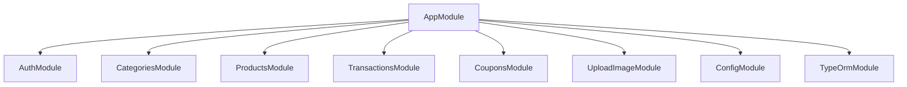
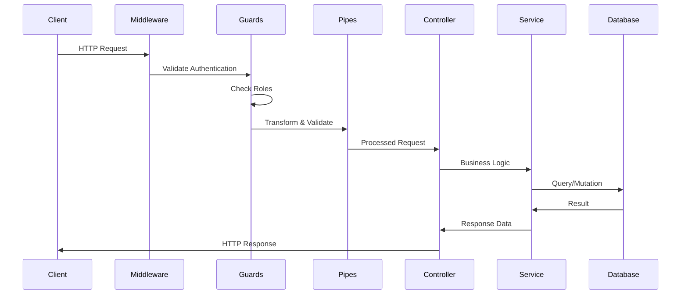

## Overview

The POS Nest API follows a modular architecture based on NestJS best practices, implementing a clear separation of concerns through modules, controllers, services, and entities.

## NestJS Module Structure

The application is organized into feature modules, each responsible for a specific domain:



### Root Module Configuration

The `AppModule` serves as the application's entry point, registering all feature modules and global providers:

```typescript src/app.module.ts
import { Module } from '@nestjs/common';
import { ConfigModule, ConfigService } from '@nestjs/config';
import { TypeOrmModule } from '@nestjs/typeorm';
import { APP_GUARD } from '@nestjs/core';
import { AppController } from './app.controller';
import { AppService } from './app.service';
import { CategoriesModule } from './categories/categories.module';
import { typeOrmConfig } from './config/typeorm.config';
import { ProductsModule } from './products/products.module';
import { TransactionsModule } from './transactions/transactions.module';
import { CouponsModule } from './coupons/coupons.module';
import { UploadImageModule } from './upload-image/upload-image.module';
import { AuthModule } from './auth/auth.module';
import { SupabaseAuthGuard } from './auth/guards/supabase-auth.guard';
import { RolesGuard } from './auth/guards/roles.guard';

@Module({
  imports: [
    ConfigModule.forRoot({
      isGlobal: true,
    }),
    TypeOrmModule.forRootAsync({
      useFactory: typeOrmConfig,
      inject: [ConfigService],
    }),
    AuthModule,
    CategoriesModule,
    ProductsModule,
    TransactionsModule,
    CouponsModule,
    UploadImageModule,
  ],
  controllers: [AppController],
  providers: [
    AppService,
    {
      provide: APP_GUARD,
      useClass: SupabaseAuthGuard,
    },
    {
      provide: APP_GUARD,
      useClass: RolesGuard,
    },
  ],
})
export class AppModule {}
```

<Note>
  Global guards are registered at the application level, ensuring authentication and authorization checks run on all routes by default.
</Note>

## MVC Pattern: Controllers, Services, and Entities

The application follows the Model-View-Controller pattern adapted for APIs:

### Controllers

Controllers handle HTTP requests and delegate business logic to services:

```typescript src/products/products.controller.ts
import {
  Controller,
  Get,
  Post,
  Body,
  Patch,
  Param,
  Delete,
  Query,
} from '@nestjs/common';
import { ProductsService } from './products.service';
import { CreateProductDto } from './dto/create-product.dto';
import { Public } from '../auth/decorators/public.decorator';
import { Roles } from '../auth/decorators/roles.decorator';

@Controller('products')
export class ProductsController {
  constructor(private readonly productsService: ProductsService) {}

  @Post()
  @Roles('admin')
  create(@Body() createProductDto: CreateProductDto) {
    return this.productsService.create(createProductDto);
  }

  @Get()
  @Public()
  findAll(@Query() query: GetProductsQueryDto) {
    return this.productsService.findAll(category, take, skip);
  }

  @Get(':id')
  @Public()
  findOne(@Param('id', IdValidationPipe) id: string) {
    return this.productsService.findOne(+id);
  }
}
```

### Services

Services contain business logic and interact with the database through repositories:

- Encapsulate business logic
- Handle data manipulation
- Interact with TypeORM repositories
- Throw appropriate exceptions

### Entities

Entities define the database schema and relationships using TypeORM decorators:

```typescript src/products/entities/product.entity.ts
import { Category } from '../../categories/entities/category.entity';
import { Column, Entity, ManyToOne, PrimaryGeneratedColumn } from 'typeorm';

@Entity()
export class Product {
  @PrimaryGeneratedColumn()
  id: number;

  @Column({ type: 'varchar', length: 60 })
  name: string;

  @Column({
    type: 'varchar',
    length: 255,
    nullable: true,
    default: 'default.svg',
  })
  image: string;

  @Column({ type: 'decimal' })
  price: number;

  @Column({ type: 'int' })
  inventory: number;

  @Column()
  categoryId: number;

  @ManyToOne(() => Category)
  category: Category;
}
```

## Request Lifecycle

Every HTTP request flows through several layers:



### Request Flow Breakdown

1. **Middleware**: CORS, body parsing, static file serving
2. **Guards**: Authentication (SupabaseAuthGuard) → Authorization (RolesGuard)
3. **Pipes**: Validation (ValidationPipe), transformation (IdValidationPipe)
4. **Controller**: Route handler execution
5. **Service**: Business logic processing
6. **Repository/Database**: Data persistence

## Module Dependencies

Feature modules can import other modules to use their services:

```typescript
@Module({
  imports: [TypeOrmModule.forFeature([Product, Category])],
  controllers: [ProductsController],
  providers: [ProductsService],
  exports: [ProductsService], // Make service available to other modules
})
export class ProductsModule {}
```

<Info>
  The `ConfigModule` is marked as global, making configuration available to all modules without explicit imports.
</Info>

## Global Configuration

### Environment Configuration

The application uses `@nestjs/config` for environment variable management:

```typescript src/main.ts
import { NestFactory } from '@nestjs/core';
import { AppModule } from './app.module';
import { ValidationPipe } from '@nestjs/common';

async function bootstrap() {
  const app = await NestFactory.create(AppModule);
  
  app.enableCors({
    origin: true,
    methods: 'GET,HEAD,PUT,PATCH,POST,DELETE,OPTIONS',
    allowedHeaders: 'Content-Type,Authorization',
    credentials: true,
  });
  
  app.useGlobalPipes(
    new ValidationPipe({
      whitelist: true,
    }),
  );
  
  await app.listen(process.env.PORT ?? 3000);
}
bootstrap();
```

### Global Pipes

The `ValidationPipe` is configured globally with:
- `whitelist: true` - Strips properties not in the DTO
- Automatic validation of all DTOs using class-validator

## Best Practices

<CardGroup cols={2}>
  <Card title="Single Responsibility" icon="check">
    Each module handles one feature domain
  </Card>
  <Card title="Dependency Injection" icon="plug">
    Services injected via constructors
  </Card>
  <Card title="Separation of Concerns" icon="layer-group">
    Controllers handle routing, services handle logic
  </Card>
  <Card title="Type Safety" icon="shield">
    TypeScript ensures compile-time type checking
  </Card>
</CardGroup>

## Related Documentation

<CardGroup cols={2}>
  <Card title="Authentication" icon="lock" href="/concepts/authentication">
    Learn about Supabase authentication and guards
  </Card>
  <Card title="Database" icon="database" href="/concepts/database">
    Understand TypeORM configuration and entities
  </Card>
  <Card title="Error Handling" icon="triangle-exclamation" href="/concepts/error-handling">
    Handle exceptions and validation errors
  </Card>
  <Card title="API Reference" icon="code" href="/api/auth/signup">
    Explore available endpoints
  </Card>
</CardGroup>