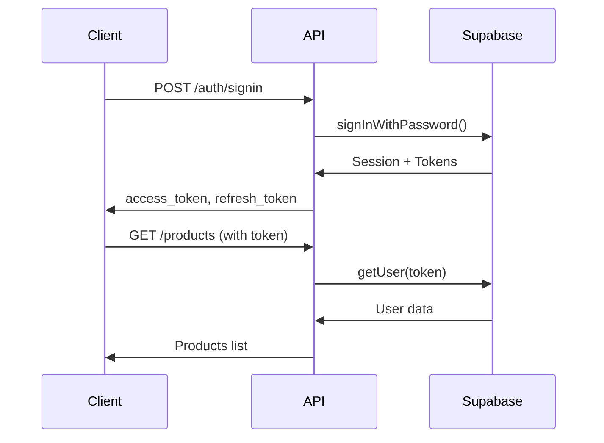

## Overview

The POS Nest API uses Supabase for authentication, implementing JWT-based token authentication with role-based access control (RBAC). All routes are protected by default, requiring explicit marking for public access.

## Supabase Integration

Authentication is handled through Supabase's authentication service, which provides:

- User registration and login
- JWT token generation and validation
- Role management via user metadata
- Secure password handling

### Authentication Service

The `AuthService` manages user authentication operations:

```typescript src/auth/auth.service.ts
import {
  BadRequestException,
  Inject,
  Injectable,
  UnauthorizedException,
} from '@nestjs/common';
import { SupabaseClient } from '@supabase/supabase-js';

@Injectable()
export class AuthService {
  constructor(
    @Inject('SUPABASE_AUTH') private readonly supabase: SupabaseClient,
  ) {}

  async signUp(signUpDto: SignUpDto) {
    const { email, password } = signUpDto;

    const { data, error } = await this.supabase.auth.admin.createUser({
      email,
      password,
      app_metadata: { role: 'user' },
      email_confirm: true,
    });

    if (error) {
      throw new BadRequestException(error.message);
    }

    return {
      message: 'User created successfully',
      user: {
        id: data.user.id,
        email: data.user.email,
        role: data.user.app_metadata?.role,
      },
    };
  }

  async signIn(signInDto: SignInDto) {
    const { email, password } = signInDto;

    const { data, error } = await this.supabase.auth.signInWithPassword({
      email,
      password,
    });

    if (error) {
      throw new UnauthorizedException(error.message);
    }

    return {
      message: 'Login successful',
      user: {
        id: data.user.id,
        email: data.user.email,
        role: data.user.app_metadata?.role,
      },
      access_token: data.session.access_token,
      refresh_token: data.session.refresh_token,
      expires_in: data.session.expires_in,
    };
  }
}
```

<Note>
  Users are assigned a role in `app_metadata` during registration. The default role is `user`, while admins are created separately.
</Note>

## Role-Based Access Control

The API implements a two-tier role system:

- **user**: Standard users with limited permissions
- **admin**: Administrators with full access

### Creating Admin Users

Admin users are created through a dedicated endpoint:

```typescript src/auth/auth.service.ts
async createAdmin(createAdminDto: CreateAdminDto) {
  const { email, password } = createAdminDto;

  const { data, error } = await this.supabase.auth.admin.createUser({
    email,
    password,
    app_metadata: { role: 'admin' },
    email_confirm: true,
  });

  if (error) {
    throw new BadRequestException(error.message);
  }

  return {
    message: 'Admin user created successfully',
    user: {
      id: data.user.id,
      email: data.user.email,
      role: data.user.app_metadata?.role,
    },
  };
}
```

## Guards

The application uses two global guards to protect routes:

### SupabaseAuthGuard

Validates JWT tokens and attaches user information to requests:

```typescript src/auth/guards/supabase-auth.guard.ts
import {
  CanActivate,
  ExecutionContext,
  Inject,
  Injectable,
  UnauthorizedException,
} from '@nestjs/common';
import { Reflector } from '@nestjs/core';
import { SupabaseClient } from '@supabase/supabase-js';
import { IS_PUBLIC_KEY } from '../decorators/public.decorator';

@Injectable()
export class SupabaseAuthGuard implements CanActivate {
  constructor(
    @Inject('SUPABASE_AUTH') private readonly supabase: SupabaseClient,
    private readonly reflector: Reflector,
  ) {}

  async canActivate(context: ExecutionContext): Promise<boolean> {
    const isPublic = this.reflector.getAllAndOverride<boolean>(IS_PUBLIC_KEY, [
      context.getHandler(),
      context.getClass(),
    ]);

    const request = context.switchToHttp().getRequest();
    const token = this.extractTokenFromHeader(request);

    if (isPublic && !token) {
      return true;
    }

    if (!token) {
      throw new UnauthorizedException('Missing authorization token');
    }

    try {
      const {
        data: { user },
        error,
      } = await this.supabase.auth.getUser(token);

      if (error || !user) {
        throw new UnauthorizedException('Invalid or expired token');
      }

      request.user = {
        id: user.id,
        email: user.email,
        role: user.app_metadata?.role ?? 'user',
        app_metadata: user.app_metadata,
        user_metadata: user.user_metadata,
      };

      return true;
    } catch (error) {
      if (error instanceof UnauthorizedException) {
        throw error;
      }
      throw new UnauthorizedException('Invalid or expired token');
    }
  }

  private extractTokenFromHeader(request: any): string | undefined {
    const [type, token] = request.headers.authorization?.split(' ') ?? [];
    return type === 'Bearer' ? token : undefined;
  }
}
```

### RolesGuard

Enforces role-based access control:

```typescript src/auth/guards/roles.guard.ts
import {
  CanActivate,
  ExecutionContext,
  ForbiddenException,
  Injectable,
} from '@nestjs/common';
import { Reflector } from '@nestjs/core';
import { ROLES_KEY } from '../decorators/roles.decorator';

@Injectable()
export class RolesGuard implements CanActivate {
  constructor(private readonly reflector: Reflector) {}

  canActivate(context: ExecutionContext): boolean {
    const requiredRoles = this.reflector.getAllAndOverride<string[]>(
      ROLES_KEY,
      [context.getHandler(), context.getClass()],
    );

    if (!requiredRoles || requiredRoles.length === 0) {
      return true;
    }

    const request = context.switchToHttp().getRequest();
    const user = request.user;

    if (!user) {
      throw new ForbiddenException('Access denied');
    }

    const hasRole = requiredRoles.includes(user.role);
    if (!hasRole) {
      throw new ForbiddenException(
        `Access denied. Required role: ${requiredRoles.join(', ')}`,
      );
    }

    return true;
  }
}
```

## Decorators

Custom decorators simplify authentication and authorization:

### @Public()

Marks routes as publicly accessible:

```typescript src/auth/decorators/public.decorator.ts
import { SetMetadata } from '@nestjs/common';

export const IS_PUBLIC_KEY = 'isPublic';
export const Public = () => SetMetadata(IS_PUBLIC_KEY, true);
```

**Usage:**

```typescript
@Get()
@Public()
findAll() {
  return this.productsService.findAll();
}
```

### @Roles()

Restricts routes to specific roles:

```typescript src/auth/decorators/roles.decorator.ts
import { SetMetadata } from '@nestjs/common';

export const ROLES_KEY = 'roles';
export const Roles = (...roles: string[]) => SetMetadata(ROLES_KEY, roles);
```

**Usage:**

```typescript
@Post()
@Roles('admin')
create(@Body() createProductDto: CreateProductDto) {
  return this.productsService.create(createProductDto);
}
```

### @CurrentUser()

Extracts user information from the request:

```typescript src/auth/decorators/current-user.decorator.ts
import { createParamDecorator, ExecutionContext } from '@nestjs/common';

export const CurrentUser = createParamDecorator(
  (data: string | undefined, ctx: ExecutionContext) => {
    const request = ctx.switchToHttp().getRequest();
    const user = request.user;
    return data ? user?.[data] : user;
  },
);
```

**Usage:**

```typescript
@Get('profile')
getProfile(@CurrentUser() user: any) {
  return user;
}

@Get('email')
getEmail(@CurrentUser('email') email: string) {
  return { email };
}
```

## Token Management

### Request Headers

Include the access token in the Authorization header:

```bash
Authorization: Bearer <access_token>
```

### Token Flow



### Authentication Response

```json
{
  "message": "Login successful",
  "user": {
    "id": "550e8400-e29b-41d4-a716-446655440000",
    "email": "user@example.com",
    "role": "user"
  },
  "access_token": "eyJhbGciOiJIUzI1NiIsInR5cCI6IkpXVCJ9...",
  "refresh_token": "v1.MRjsZYy4ZXEuLTExMS00MDQ5LWJh...",
  "expires_in": 3600
}
```

## Route Protection Examples

### Public Routes

Accessible without authentication:

```typescript
@Controller('products')
export class ProductsController {
  @Get()
  @Public()
  findAll() {
    // Anyone can access
    return this.productsService.findAll();
  }

  @Get(':id')
  @Public()
  findOne(@Param('id') id: string) {
    // Anyone can access
    return this.productsService.findOne(+id);
  }
}
```

### Protected Routes

Require authentication (default behavior):

```typescript
@Get('profile')
getProfile(@CurrentUser() user: any) {
  // Requires valid token
  return user;
}
```

### Admin-Only Routes

Require admin role:

```typescript
@Post()
@Roles('admin')
create(@Body() createProductDto: CreateProductDto) {
  // Only admins can access
  return this.productsService.create(createProductDto);
}

@Delete(':id')
@Roles('admin')
remove(@Param('id') id: string) {
  // Only admins can access
  return this.productsService.remove(+id);
}
```

## Security Best Practices

<Warning>
  Never expose your Supabase service role key in client-side code. Use environment variables for all sensitive credentials.
</Warning>

<CardGroup cols={2}>
  <Card title="Strong Passwords" icon="key">
    Enforce minimum 6-character passwords using validation
  </Card>
  <Card title="Token Validation" icon="shield-check">
    All tokens validated against Supabase on each request
  </Card>
  <Card title="Role Enforcement" icon="user-shield">
    Roles checked at the guard level before controller execution
  </Card>
  <Card title="HTTPS Only" icon="lock">
    Always use HTTPS in production environments
  </Card>
</CardGroup>

## Related Documentation

<CardGroup cols={2}>
  <Card title="Architecture" icon="sitemap" href="/concepts/architecture">
    Learn about the application structure
  </Card>
  <Card title="Error Handling" icon="triangle-exclamation" href="/concepts/error-handling">
    Handle authentication errors
  </Card>
  <Card title="Auth Endpoints" icon="right-to-bracket" href="/api/auth/signup">
    API reference for authentication
  </Card>
</CardGroup>