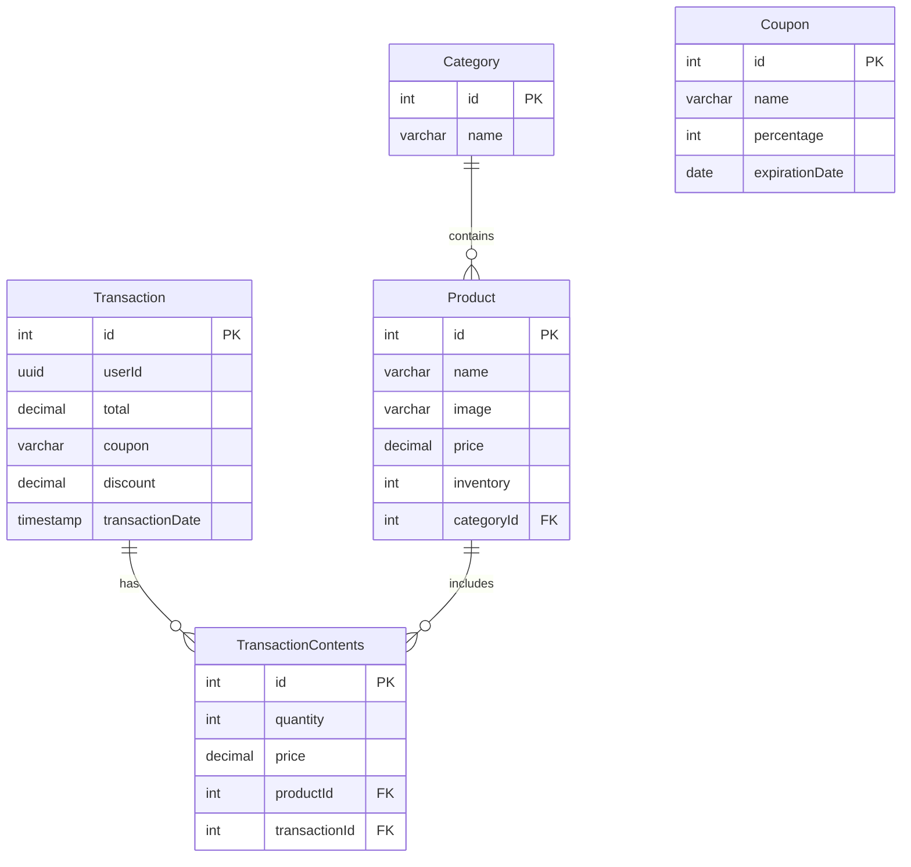

## Overview

The POS Nest API uses TypeORM as its Object-Relational Mapping (ORM) layer, connecting to a PostgreSQL database. TypeORM handles entity management, relationships, and database synchronization.

## TypeORM Configuration

The database configuration is managed through a factory function that injects environment variables:

```typescript src/config/typeorm.config.ts
import { ConfigService } from '@nestjs/config';
import type { TypeOrmModuleOptions } from '@nestjs/typeorm';
import { join } from 'path';

export const typeOrmConfig = (
  configService: ConfigService,
): TypeOrmModuleOptions => ({
  type: 'postgres',
  host: configService.get('DATABASE_HOST'),
  port: configService.get('DATABASE_PORT'),
  username: configService.get('DATABASE_USER'),
  password: configService.get('DATABASE_PASS'),
  database: configService.get('DATABASE_NAME'),
  ssl: {
    rejectUnauthorized: false,
  },
  logging: false,
  entities: [join(__dirname, '..', '**', '*.entity.{ts,js}')],
  synchronize: true,
});
```

### Configuration Parameters

<ParamField path="type" type="string" default="postgres">
  Database type - PostgreSQL is used for this application
</ParamField>

<ParamField path="synchronize" type="boolean" default="true">
  Auto-creates database tables from entities. **Disable in production!**
</ParamField>

<ParamField path="entities" type="string[]">
  Auto-discovers all files matching `*.entity.ts` pattern
</ParamField>

<ParamField path="ssl" type="object">
  Enables SSL connections (required for most cloud databases)
</ParamField>

<Warning>
  Set `synchronize: false` in production. Use migrations instead to avoid data loss.
</Warning>

### Module Registration

TypeORM is registered asynchronously in the root module:

```typescript src/app.module.ts
import { TypeOrmModule } from '@nestjs/typeorm';
import { ConfigService } from '@nestjs/config';
import { typeOrmConfig } from './config/typeorm.config';

@Module({
  imports: [
    TypeOrmModule.forRootAsync({
      useFactory: typeOrmConfig,
      inject: [ConfigService],
    }),
    // ... other modules
  ],
})
export class AppModule {}
```

## Database Schema

The application uses four main entities with the following relationships:



## Entities

### Category Entity

Represents product categories:

```typescript src/categories/entities/category.entity.ts
import { Product } from '../../products/entities/product.entity';
import { BaseEntity, Column, Entity, OneToMany, PrimaryGeneratedColumn } from 'typeorm';

@Entity()
export class Category extends BaseEntity {
  @PrimaryGeneratedColumn()
  id: number;

  @Column({ type: 'varchar', length: 60 })
  name: string;

  @OneToMany(() => Product, (product) => product.category, { cascade: true })
  products: Product[]
}
```

**Relationships:**
- One-to-Many with Products (one category can have many products)
- Cascade operations enabled (deleting a category affects its products)

### Product Entity

Represents products available for sale:

```typescript src/products/entities/product.entity.ts
import { Category } from '../../categories/entities/category.entity';
import { Column, Entity, ManyToOne, PrimaryGeneratedColumn } from 'typeorm';

@Entity()
export class Product {
  @PrimaryGeneratedColumn()
  id: number;

  @Column({ type: 'varchar', length: 60 })
  name: string;

  @Column({
    type: 'varchar',
    length: 255,
    nullable: true,
    default: 'default.svg',
  })
  image: string;

  @Column({ type: 'decimal' })
  price: number;

  @Column({ type: 'int' })
  inventory: number;

  @Column()
  categoryId: number;

  @ManyToOne(() => Category)
  category: Category;
}
```

**Key Features:**
- Default image value (`default.svg`)
- Decimal price type for accurate currency handling
- Many-to-One relationship with Category

### Transaction Entities

Represents sales transactions and their contents:

```typescript src/transactions/entities/transaction.entity.ts
import { Product } from '../../products/entities/product.entity';
import {
  Column,
  Entity,
  ManyToOne,
  OneToMany,
  PrimaryGeneratedColumn,
} from 'typeorm';

@Entity()
export class Transaction {
  @PrimaryGeneratedColumn()
  id: number;

  @Column({ type: 'uuid', nullable: true })
  userId: string;

  @Column('decimal')
  total: number;

  @Column({ type: 'varchar', length: 30, nullable: true })
  coupon: string;

  @Column({ type: 'decimal', default: 0 })
  discount: number;

  @Column({ type: 'timestamp without time zone' })
  transactionDate: Date;

  @OneToMany(
    () => TransactionContents,
    (transactions) => transactions.transaction,
  )
  contents: TransactionContents[];
}

@Entity()
export class TransactionContents {
  @PrimaryGeneratedColumn()
  id: number;

  @Column('int')
  quantity: number;

  @Column('decimal')
  price: number;

  @ManyToOne(() => Product, (product) => product.id, {
    eager: true,
    cascade: true,
  })
  product: Product;

  @ManyToOne(() => Transaction, (transaction) => transaction.contents, {
    cascade: true,
  })
  transaction: Transaction;
}
```

**Relationships:**
- Transaction has many TransactionContents (one-to-many)
- TransactionContents references Product (many-to-one with eager loading)
- Supports coupon codes and discount tracking

### Coupon Entity

Represents discount coupons:

```typescript src/coupons/entities/coupon.entity.ts
import { Column, Entity, PrimaryGeneratedColumn } from 'typeorm';

@Entity()
export class Coupon {
  @PrimaryGeneratedColumn()
  id: number;

  @Column({type: 'varchar', length: 30})
  name: string;

  @Column({type: 'int'})
  percentage: number;

  @Column({type: 'date'})
  expirationDate: Date;
}
```

## Entity Relationships

### One-to-Many

Categories to Products:

```typescript
// In Category entity
@OneToMany(() => Product, (product) => product.category, { cascade: true })
products: Product[]

// In Product entity
@ManyToOne(() => Category)
category: Category;
```

### Cascade Operations

<Info>
  Cascade options determine how operations propagate through relationships:
  - `cascade: true` - All operations cascade
  - `cascade: ['insert', 'update']` - Only specific operations cascade
</Info>

### Eager Loading

The `eager: true` option automatically loads related entities:

```typescript
@ManyToOne(() => Product, (product) => product.id, {
  eager: true,  // Product automatically loaded with TransactionContents
  cascade: true,
})
product: Product;
```

## Repository Pattern

Services interact with the database using TypeORM repositories:

```typescript
import { Injectable } from '@nestjs/common';
import { InjectRepository } from '@nestjs/typeorm';
import { Repository } from 'typeorm';
import { Product } from './entities/product.entity';

@Injectable()
export class ProductsService {
  constructor(
    @InjectRepository(Product)
    private readonly productRepository: Repository<Product>,
  ) {}

  async findAll() {
    return await this.productRepository.find();
  }

  async findOne(id: number) {
    return await this.productRepository.findOne({ where: { id } });
  }

  async create(createProductDto: CreateProductDto) {
    const product = this.productRepository.create(createProductDto);
    return await this.productRepository.save(product);
  }

  async update(id: number, updateProductDto: UpdateProductDto) {
    await this.productRepository.update(id, updateProductDto);
    return this.findOne(id);
  }

  async remove(id: number) {
    return await this.productRepository.delete(id);
  }
}
```

## Column Types

Common column types used in the application:

| TypeORM Type | PostgreSQL Type | Use Case |
|--------------|-----------------|----------|
| `varchar` | VARCHAR | Short text (names, emails) |
| `decimal` | NUMERIC | Prices, monetary values |
| `int` | INTEGER | Counts, IDs |
| `uuid` | UUID | User IDs (from Supabase) |
| `timestamp` | TIMESTAMP | Date and time |
| `date` | DATE | Dates only |

## Environment Variables

Required database configuration variables:

```bash .env
DATABASE_HOST=your-database-host
DATABASE_PORT=5432
DATABASE_USER=your-username
DATABASE_PASS=your-password
DATABASE_NAME=pos_nest_db
```

## Best Practices

<CardGroup cols={2}>
  <Card title="Use Repositories" icon="database">
    Always inject and use TypeORM repositories for database operations
  </Card>
  <Card title="Disable Synchronize" icon="triangle-exclamation">
    Set `synchronize: false` in production and use migrations
  </Card>
  <Card title="Handle Relationships" icon="link">
    Use TypeORM decorators to define entity relationships clearly
  </Card>
  <Card title="Use Transactions" icon="arrows-rotate">
    Wrap complex operations in database transactions
  </Card>
</CardGroup>

## Migrations

<Warning>
  This application currently uses `synchronize: true` for automatic schema updates. For production, implement TypeORM migrations:
</Warning>

```bash
# Generate migration
npm run migration:generate -- -n MigrationName

# Run migrations
npm run migration:run

# Revert migration
npm run migration:revert
```

## Related Documentation

<CardGroup cols={2}>
  <Card title="Architecture" icon="sitemap" href="/concepts/architecture">
    Learn about the overall application structure
  </Card>
  <Card title="API Reference" icon="code" href="/api/auth/signup">
    Explore database-backed endpoints
  </Card>
  <Card title="Error Handling" icon="triangle-exclamation" href="/concepts/error-handling">
    Handle database errors properly
  </Card>
</CardGroup>