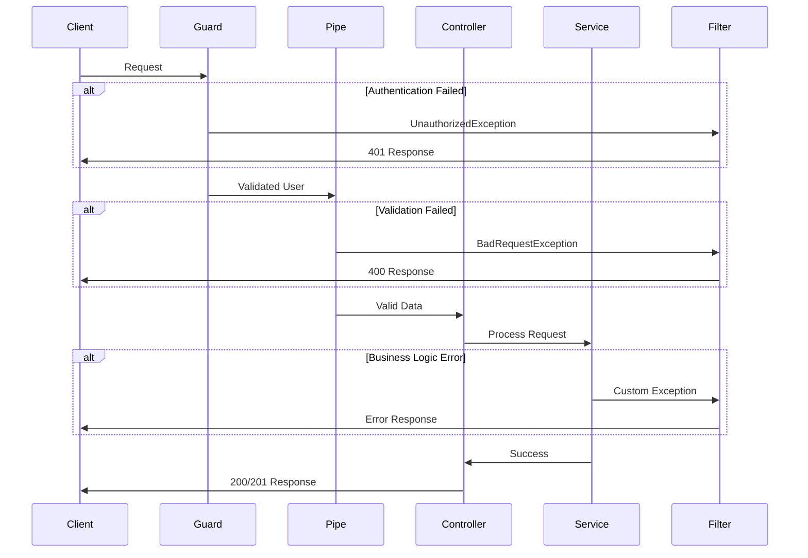

## Overview

The POS Nest API implements comprehensive error handling through NestJS's built-in exception filters, validation pipes, and custom error responses. All errors are returned in a consistent JSON format.

## NestJS Exception Filters

NestJS provides built-in HTTP exceptions that are automatically caught and formatted:

### Built-in Exceptions

The application uses standard NestJS exceptions throughout:

```typescript
import {
  BadRequestException,
  UnauthorizedException,
  ForbiddenException,
  NotFoundException,
} from '@nestjs/common';
```

| Exception | HTTP Status | Use Case |
|-----------|-------------|----------|
| `BadRequestException` | 400 | Invalid input, validation failures |
| `UnauthorizedException` | 401 | Missing or invalid authentication |
| `ForbiddenException` | 403 | Insufficient permissions |
| `NotFoundException` | 404 | Resource not found |

## Validation Pipes

The application uses `class-validator` with NestJS's `ValidationPipe` for automatic DTO validation.

### Global Validation Pipe

Configured globally in `main.ts`:

```typescript src/main.ts
import { ValidationPipe } from '@nestjs/common';

async function bootstrap() {
  const app = await NestFactory.create(AppModule);
  
  app.useGlobalPipes(
    new ValidationPipe({
      whitelist: true,
    }),
  );
  
  await app.listen(process.env.PORT ?? 3000);
}
bootstrap();
```

**Configuration:**
- `whitelist: true` - Strips properties not defined in the DTO
- Automatically validates all incoming requests
- Returns detailed validation error messages

### DTO Validation Examples

#### Sign Up DTO

```typescript src/auth/dto/sign-up.dto.ts
import { IsEmail, IsNotEmpty, IsString, MinLength } from 'class-validator';

export class SignUpDto {
  @IsEmail()
  @IsNotEmpty()
  email: string;

  @IsString()
  @IsNotEmpty()
  @MinLength(6)
  password: string;
}
```

**Validation rules:**
- Email must be a valid email format
- Email cannot be empty
- Password must be a string
- Password must be at least 6 characters

#### Create Product DTO

```typescript src/products/dto/create-product.dto.ts
import { IsIn, IsInt, IsNotEmpty, IsNumber, IsString } from "class-validator";

export class CreateProductDto {
  @IsNotEmpty({message: 'The product name is required.'})
  @IsString({message: 'Invalid name.'})
  name: string;

  @IsNotEmpty({message: 'The product price is required.'})
  @IsNumber({maxDecimalPlaces: 2}, {message: 'The product price must be a number.'})
  price: number;

  @IsNotEmpty({message: 'The product image is required.'})
  image: string;

  @IsNotEmpty({message: 'The quantity cannot be empty.'})
  @IsNumber({maxDecimalPlaces: 0}, {message: 'invalid amount of inventory'})
  inventory: number;

  @IsNotEmpty({message: 'The category ID is required.'})
  @IsInt({message: 'Invalid category'})
  categoryId: number;
}
```

**Custom error messages** provide clear feedback to API consumers.

### Validation Error Response

When validation fails, NestJS returns a structured error:

```json
{
  "statusCode": 400,
  "message": [
    "email must be an email",
    "password must be longer than or equal to 6 characters"
  ],
  "error": "Bad Request"
}
```

## Custom Pipes

### ID Validation Pipe

A custom pipe ensures ID parameters are valid integers:

```typescript src/common/pipes/id-validation/id-validation.pipe.ts
import { BadRequestException, Injectable, ParseIntPipe } from '@nestjs/common';

@Injectable()
export class IdValidationPipe extends ParseIntPipe {
  constructor() {
    super({
      exceptionFactory: () => new BadRequestException('Invalid ID format'),
    });
  }
}
```

**Usage in controllers:**

```typescript src/products/products.controller.ts
import { IdValidationPipe } from '../common/pipes/id-validation/id-validation.pipe';

@Get(':id')
@Public()
findOne(@Param('id', IdValidationPipe) id: string) {
  return this.productsService.findOne(+id);
}
```

**Error response for invalid ID:**

```json
{
  "statusCode": 400,
  "message": "Invalid ID format",
  "error": "Bad Request"
}
```

## Authentication Errors

### Missing Token

When no authentication token is provided:

```typescript src/auth/guards/supabase-auth.guard.ts
if (!token) {
  throw new UnauthorizedException('Missing authorization token');
}
```

**Response:**

```json
{
  "statusCode": 401,
  "message": "Missing authorization token",
  "error": "Unauthorized"
}
```

### Invalid Token

When the token is invalid or expired:

```typescript src/auth/guards/supabase-auth.guard.ts
if (error || !user) {
  throw new UnauthorizedException('Invalid or expired token');
}
```

**Response:**

```json
{
  "statusCode": 401,
  "message": "Invalid or expired token",
  "error": "Unauthorized"
}
```

## Authorization Errors

### Insufficient Permissions

When a user lacks required roles:

```typescript src/auth/guards/roles.guard.ts
const hasRole = requiredRoles.includes(user.role);
if (!hasRole) {
  throw new ForbiddenException(
    `Access denied. Required role: ${requiredRoles.join(', ')}`,
  );
}
```

**Response:**

```json
{
  "statusCode": 403,
  "message": "Access denied. Required role: admin",
  "error": "Forbidden"
}
```

## Service-Level Errors

### Supabase Authentication Errors

Errors from Supabase are wrapped in appropriate exceptions:

```typescript src/auth/auth.service.ts
async signUp(signUpDto: SignUpDto) {
  const { email, password } = signUpDto;

  const { data, error } = await this.supabase.auth.admin.createUser({
    email,
    password,
    app_metadata: { role: 'user' },
    email_confirm: true,
  });

  if (error) {
    throw new BadRequestException(error.message);
  }

  return {
    message: 'User created successfully',
    user: {
      id: data.user.id,
      email: data.user.email,
      role: data.user.app_metadata?.role,
    },
  };
}
```

### Sign In Errors

```typescript src/auth/auth.service.ts
async signIn(signInDto: SignInDto) {
  const { email, password } = signInDto;

  const { data, error } = await this.supabase.auth.signInWithPassword({
    email,
    password,
  });

  if (error) {
    throw new UnauthorizedException(error.message);
  }

  return { /* ... */ };
}
```

## Common Error Scenarios

### 1. Invalid Request Body

**Request:**
```bash
POST /products
{
  "name": "",
  "price": "invalid"
}
```

**Response:**
```json
{
  "statusCode": 400,
  "message": [
    "The product name is required.",
    "The product price must be a number.",
    "The product image is required.",
    "The quantity cannot be empty.",
    "The category ID is required."
  ],
  "error": "Bad Request"
}
```

### 2. Missing Authentication

**Request:**
```bash
POST /products
# No Authorization header
```

**Response:**
```json
{
  "statusCode": 401,
  "message": "Missing authorization token",
  "error": "Unauthorized"
}
```

### 3. Insufficient Permissions

**Request:**
```bash
POST /products
Authorization: Bearer <user_token>
# User has 'user' role, but 'admin' required
```

**Response:**
```json
{
  "statusCode": 403,
  "message": "Access denied. Required role: admin",
  "error": "Forbidden"
}
```

### 4. Invalid ID Parameter

**Request:**
```bash
GET /products/abc
```

**Response:**
```json
{
  "statusCode": 400,
  "message": "Invalid ID format",
  "error": "Bad Request"
}
```

### 5. File Upload Error

**Request:**
```bash
POST /products/upload-image
# No file attached
```

**Response:**
```json
{
  "statusCode": 400,
  "message": "The image is required",
  "error": "Bad Request"
}
```

```typescript src/products/products.controller.ts
@Post('upload-image')
@Roles('admin')
@UseInterceptors(FileInterceptor('file'))
uploadImage(@UploadedFile() file: Express.Multer.File) {
  if (!file) {
    throw new BadRequestException('The image is required');
  }

  return this.uploadImageService.uploadFile(file);
}
```

## Error Response Format

All errors follow a consistent structure:

```typescript
{
  statusCode: number;      // HTTP status code
  message: string | string[]; // Error message(s)
  error: string;           // Error type name
}
```

## Exception Flow



## Best Practices

<CardGroup cols={2}>
  <Card title="Use Appropriate Exceptions" icon="triangle-exclamation">
    Choose the right HTTP exception for each error scenario
  </Card>
  <Card title="Provide Clear Messages" icon="message">
    Include descriptive error messages for API consumers
  </Card>
  <Card title="Validate Early" icon="shield-check">
    Use DTOs and pipes to validate data before processing
  </Card>
  <Card title="Handle All Errors" icon="net">
    Catch and transform all errors into appropriate HTTP responses
  </Card>
</CardGroup>

## Custom Error Handling

For more complex error handling, you can create custom exception filters:

```typescript
import {
  ExceptionFilter,
  Catch,
  ArgumentsHost,
  HttpException,
} from '@nestjs/common';
import { Request, Response } from 'express';

@Catch(HttpException)
export class HttpExceptionFilter implements ExceptionFilter {
  catch(exception: HttpException, host: ArgumentsHost) {
    const ctx = host.switchToHttp();
    const response = ctx.getResponse<Response>();
    const request = ctx.getRequest<Request>();
    const status = exception.getStatus();

    response.status(status).json({
      statusCode: status,
      timestamp: new Date().toISOString(),
      path: request.url,
      message: exception.message,
    });
  }
}
```

<Info>
  The current implementation uses NestJS's default exception filter. Custom filters can be added for more sophisticated error logging and formatting.
</Info>

## Related Documentation

<CardGroup cols={2}>
  <Card title="Authentication" icon="lock" href="/concepts/authentication">
    Learn about authentication error handling
  </Card>
  <Card title="Architecture" icon="sitemap" href="/concepts/architecture">
    Understand the request lifecycle
  </Card>
  <Card title="API Reference" icon="code" href="/api/auth/signup">
    See error responses for each endpoint
  </Card>
</CardGroup>